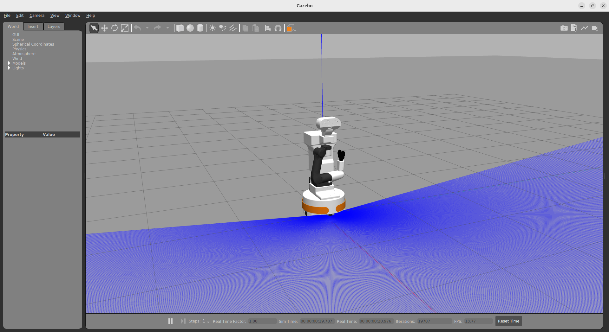
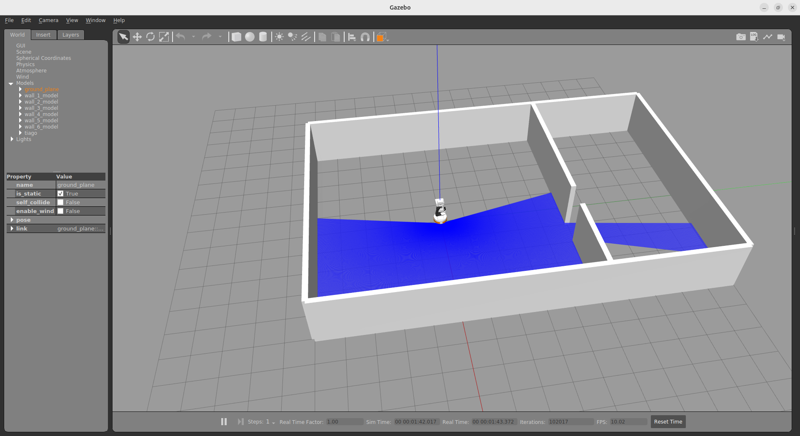
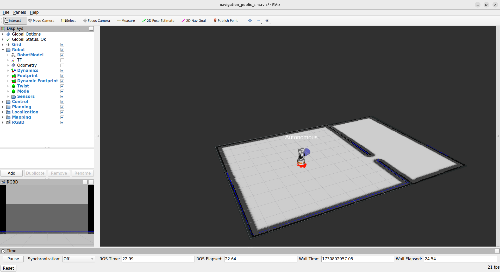

## Container
Similar to the ITR module, which you likely would've taken, we use a container for simulating and interfacing with our robot, TIAGo.
### Acquiring the Container
#### Lab Machines
The container is already provided on the lab machines and can be found at `/itr/tiago_noetic_opensource.sif`. Additionally, `apptainer/singularity` is already installed.
#### Your Own Machine
If you are using your own machine then you must execute the following steps to acquire and access the container.
1. Install [Apptainer](https://apptainer.org/), instructions are available [here](https://apptainer.org/docs/admin/main/installation.html).
2. Download the container from NextCloud:
    ```
    wget https://nextcloud.nms.kcl.ac.uk/s/BZtWJtiyP57r8YN/download -O /tmp/tiago_noetic_opensource.sif -q --show-progress && mv -f /tmp/tiago_noetic_opensource.sif tiago_noetic_opensource.sif
    ```
### Using the Container
You can enter the container by simply using `apptainer run`, for example:
```
apptainer run tiago_noetic_opensource.sif
```
There are various configurations for running the container. You may find the `terminator` configuration useful for development and testing, this can be used as such:
```
apptainer run tiago_noetic_opensource.sif terminator
```
Additional details can be found by executing:
```
apptainer run-help tiago_noetic_opensource.sif
```
If your machine has an GPU, then you may need to execute some additional steps for it to work with `apptainer/singularity`. We are only providing support for NVIDIA GPU's.
In the simplest case, all you need to do is pass an additional flag to `apptainer run`:
```
apptainer run --nv tiago_noetic_opensource.sif
```
You can check if the GPU drivers are loaded correctly by executing:
```
nvidia-smi
```
If this did not work, then you will need to additionally install the [nvidia-container-toolkit](https://docs.nvidia.com/datacenter/cloud-native/container-toolkit/latest/install-guide.html), and pass an additional flag to `apptainer/singularity`:
```
apptainer run --nv --nvccli tiago_noetic_opensource.sif
```
## Simulating TIAGo
### Empty World
To quickly test that everything is setup correctly, you can run:
```
roslaunch tiago_gazebo tiago_gazebo.launch public_sim:=true robot:=steel
```
This should launch `Gazebo`, and you should see something like the following:



This launches an empty world, with no map.

### Using Specific Worlds
You may use the `world` argument to launch a specific world with the above command:
```
roslaunch tiago_gazebo tiago_gazebo.launch public_sim:=true robot:=steel world:=simple_office
```
You should see the following world:



The launch file we have been using so far doesn't provide any mapping/localisation capabilities, meaning we cannot perform any autonomous navigation.

If we don't already have a map of the world (which we do for `simple_office`), then we must create a map using gmapping (see [this tutoral](http://wiki.ros.org/Robots/TIAGo/Tutorials/Navigation/Mapping)), and then launch the following:

```
roslaunch tiago_2dnav_gazebo tiago_navigation.launch public_sim:=true world:=simple_office
```

You should now see `Gazebo` as before as well as `RViz`, with the loaded map:



You're now ready to begin developing and run your own nodes!

## Custom Worlds
Within this repository, you will find a ROS package called `custom_worlds`, which provides some additional worlds which are more interesting and complex than the example provided above. You may wish to use these worlds in your projects.

## Frequently Asked Questions
Commonly asked questions and their respective answers will be presented here, as and when they arrive.

## Contact
If you are facing difficulties with setting up the container and/or simulating TIAGo, feel free to contact me via email at jared.swift@kcl.ac.uk. I will try my best to help you resolve your issues.